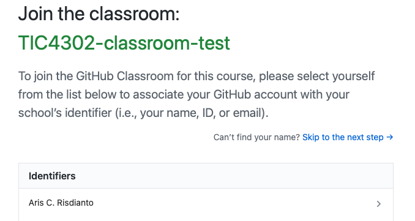
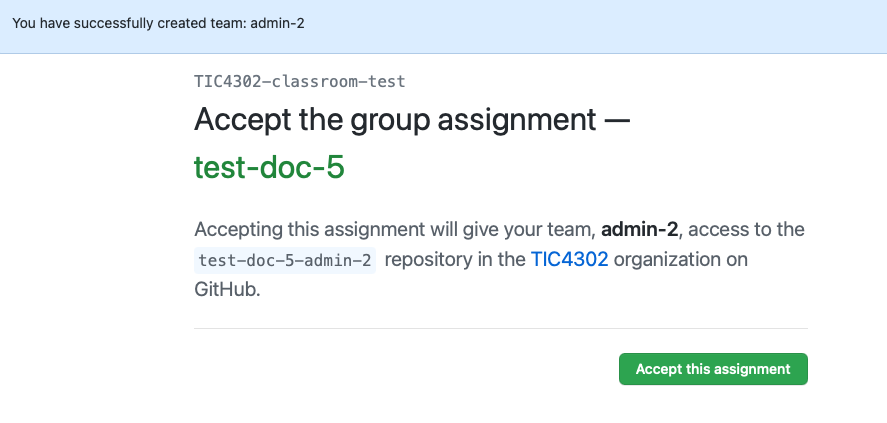
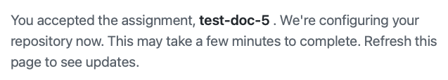

## Assignment 1 - Project Design Documentation Assignment

### Assignment

Create the design document of your project with this following guidelines:
- Download or clone the assignment repository (will be distributed later)
- Create "doc" directory
- Create file "README.md" inside "doc" directory
- Write into the file your design documentation which contains:
    - Your project name as the "First Header" of GitHub markdown
    - These sections (Overview, Objective, Design, Feature, Implementation, 
    Consideration) as "Second Header" of GitHub markdown
    - More than 50 lines

### Submission

It will automatically submit your work when you make a push commit to the 
assignment's repository.

### Grading

It will be automatically grading with "Pass" or "Failed" result. Currently, we 
are not considering how many failed of your submission, but please make as 
minimum as possible.

### Assignment URL

- For "Student-Team-A": https://classroom.github.com/g/DtFLQV1T
- For "Student-Team-B": https://classroom.github.com/g/0FpLr3QK
- For "Student-Team-C": https://classroom.github.com/g/gfvRiMru
- For "Student-Team-D": https://classroom.github.com/g/q4GFqTe_ 

Please accept the invitation and mentioned your project team name. 
For example, Project "Team-A" need to mention "Student-Team-A".

Please follow these steps for the detail:

#### Select your student ID

#### Fill your Team Name, make sure it is exactly the same with your team

#### Accept the assigment

